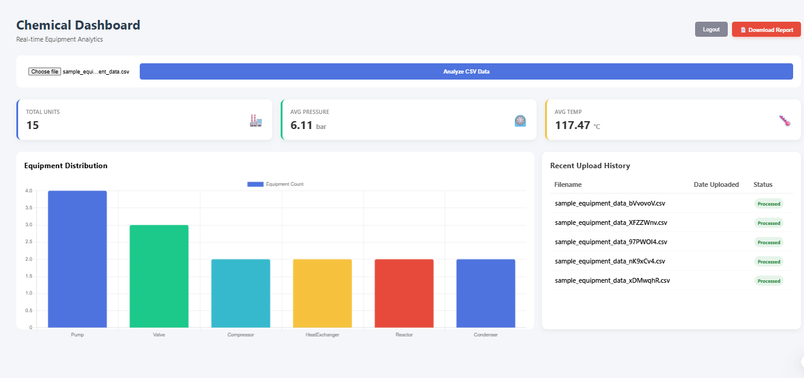

# Chemical Equipment Parameter Visualizer 🧪📊

A **Hybrid Web & Desktop Application** designed to visualize and analyze chemical equipment parameters. This project demonstrates a full-stack architecture where both a **React Web Client** and a **PyQt5 Desktop Client** consume a shared **Django REST Framework** backend.

---

## 🚀 Features

* **Hybrid Architecture:** Seamless synchronization between Web and Desktop platforms using a single database.
* **Data Analysis:** Upload CSV files to parse equipment data (Pressure, Temperature, Flowrate).
* **Interactive Visualization:**
    * **Desktop:** Native graphs using **Matplotlib**.
    * **Web:** Interactive charts using **Chart.js**.
* **History Management:** Automatically stores and syncs the last 5 uploaded datasets.
* **PDF Reporting:** Generate and download PDF reports of the current analytics.
* **Secure Authentication:** Token-based authentication for both client platforms.

---

## 🛠️ Tech Stack

| Component | Technology | Description |
| :--- | :--- | :--- |
| **Backend** | Django + DRF | REST API, Data Parsing, Authentication |
| **Web Frontend** | React.js + Chart.js | Responsive Dashboard & Visualization |
| **Desktop Client** | PyQt5 + Matplotlib | Native GUI application for Windows/Linux |
| **Data Processing** | Pandas | Efficient CSV parsing and statistical analysis |
| **Database** | SQLite | Lightweight storage for user history |

---

## 📸 Screenshots

### 1. Web & Desktop Dashboards

*(Note: If the image above doesn't load, drag and drop your screenshot file here)*

---

## ⚙️ Installation & Setup Guide

This project requires **3 separate terminals** running simultaneously.

### 1. Backend Setup (Django) 🧠
*Open Terminal 1*
```bash
cd backend

# Create & Activate Virtual Environment
python -m venv venv
# Windows:
..\venv\Scripts\activate
# Mac/Linux:
source ../venv/bin/activate

# Install Dependencies
pip install -r requirements.txt

# Setup Database & Admin
python manage.py migrate
python manage.py createsuperuser

# Start Server
python manage.py runserver
cd web-client

# Install Libraries
npm install

# Start React App
npm start